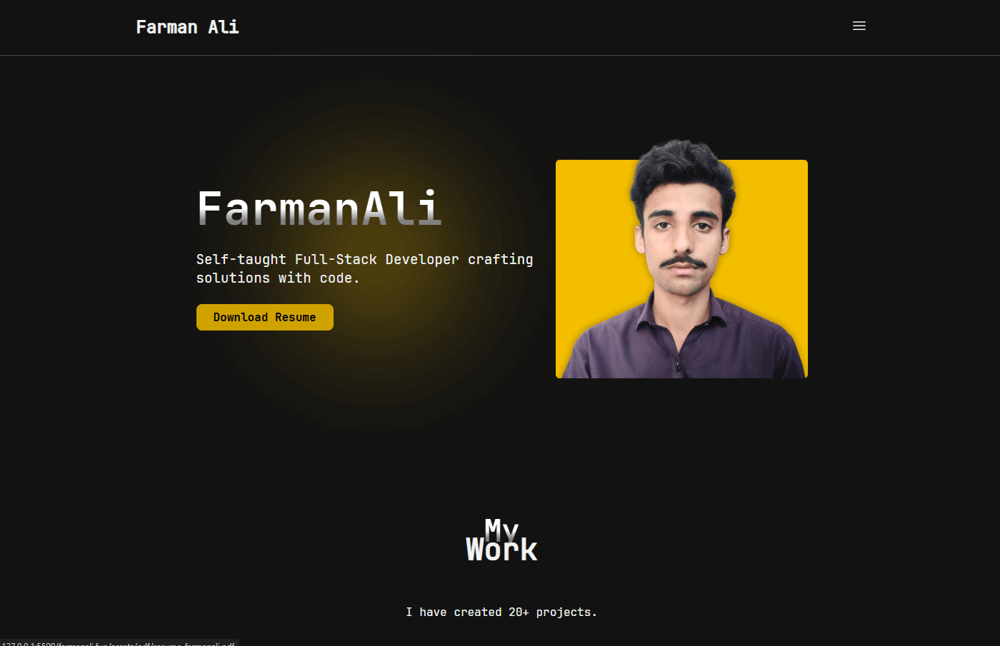

# Farman Ali's Portfolio

  
_Self-taught MERN-stack developer crafting solutions with code._

Welcome to my personal portfolio website, [farmanali.fun](https://farmanali.fun), built to showcase my skills, projects, and journey as a full-stack developer. This site is optimized for performance and deployed on Netlify.

---

## About Me

I’m Farman Ali, a self-taught MERN-stack developer from Bahawalpur, Pakistan. I graduated with a BSIT from The Islamia University Bahawalpur (2020–2024) and have built 20+ projects to hone my skills in modern web development.

---

## Features

- **Projects**: Highlights like Blogistan (React, Appwrite), My Blog (Node.js, MongoDB), and more.
- **Skills**: MERN stack (MongoDB, Express.js, React, Node.js), HTML, CSS, JavaScript.
- **Responsive Design**: Works seamlessly on mobile, tablet, and desktop.
- **Performance**: Optimized with minified CSS/JS, lazy-loaded images, and browser caching.
- **Contact**: Links to WhatsApp, GitHub, LinkedIn, and more.

---

## Tech Stack

- **Frontend**: HTML, CSS, JavaScript, React (in projects)
- **Backend**: Node.js, Express.js (in projects)
- **Database**: MongoDB (in projects), Appwrite (in Blogistan)
- **Fonts**: JetBrains Mono
- **Hosting**: Netlify
- **Tools**: VS Code, Git, GitHub

---

## Project Structure

```
farmanali.fun/
├── _headers          # Netlify caching configuration
├── index.html        # Main portfolio page
├── src/
│   ├── scripts/
│   │   └── index.js  # Navbar and skills interactivity
│   └── styles/
│       └── style.css # Styles for the site
├── assets/
│   ├── fonts/        # JetBrains Mono font files
│   ├── icons/        # SVG icons (e.g., GitHub, WhatsApp)
│   ├── images/       # Profile and project images
│   └── pdf/          # Resume PDF
└── README.md         # This file
```

---

## Setup and Installation

1. **Clone the Repo**:

   ```bash
   git clone https://github.com/farmanali6349/farmanali.fun.git
   ```

2. **Open Locally**:
   Use VS Code Live Server: Right-click index.html > "Open with Live Server".

3. **Deploy (Optional)**:
   Push to GitHub, link to Netlify, or drag the folder into Netlify’s deploy dashboard.

## Optimization Highlights

#### Performance:

- Minified CSS (style.css) and JS (index.js) for faster downloads.
- Lazy-loaded below-the-fold images (e.g., project pics) to cut initial load time.
- Preloaded critical font (JetBrainsMono-Regular.woff2) for quick text rendering.
- Browser caching via \_headers for instant repeat visits.
- **Testing**: Audited with Google Lighthouse—aiming for FCP <2s, LCP <2.5s.

## Top Projects

### 1. Blogistan

- Live: [blogistan.netlify.app](blogistan.netlify.app)
- GitHub: [github.com/farmanali6349/blogistan](github.com/farmanali6349/blogistan)

Full-stack blog platform with React and Appwrite.

### 2. My Blog

- GitHub: [github.com/farmanali6349/my-blog](github.com/farmanali6349/my-blog)

-Node.js, Express, MongoDB—secure backend with JWT auth.

### 3. Today Todo

- Live: [todaytodo1.netlify.app](todaytodo1.netlify.app)

- GitHub: [github.com/farmanali6349/todaytodo](github.com/farmanali6349/todaytodo)

React-based productivity app with local storage.

## Contact

- **Email**: [farmanali6349@gmail.com](mailto:farmanali6349@gmail.com?subject=Hello%20Farman%20Ali&body=Hi%20Farman%2C%0A%0AI%20came%20across%20your%20profile%20as%20a%20MERN%20stack%20developer%20and%20wanted%20to%20connect.%0A%0ARegards,)
- **WhatsApp**: [+92 305 3666838](https://wa.me/923053666838?text=Assalam-o-Aliakum!%20Farman%2C%20I%20saw%20your%20portfolio%20and%20wanted%20to%20connect.)
- **GitHub**: [github.com/farmanali6349](github.com/farmanali6349)
- **LinkedIn**: [linkedin.com/in/farmanali6349](linkedin.com/in/farmanali6349)

**License**
© 2025 Farman Ali. All rights reserved.
